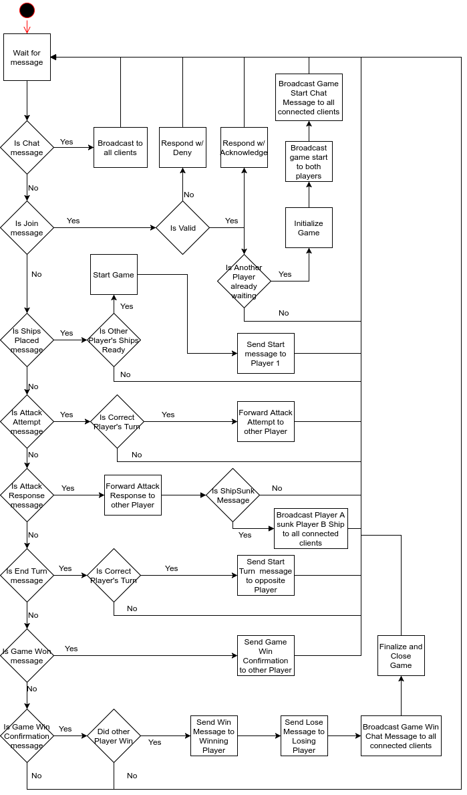

# Design Diagrams

Diagrams made using [Draw.io](https://www.draw.io/). Draw.io stores files in an XML file which can be version controlled as well as allows you to export created diagrams to PNG, JPG, PDF, etc. It has its plusses and minuses, but for our simple purposes it will be a valuable tool for this project's use.

## Import Existing Diagram

* Launch Draw.io and choose a new blank document
* File --> Open From --> Device...
* Choose desired XML file
* You can now see and modify an existing diagram

## Export Diagram & PNG

When saving either a new diagram or modifying an existing diagram, the diagrams should be exported both as an XML file as well as a PNG file. This will allow us to collaborate (via the XML) on diagrams as well as include them in documentation.

### Export XML

* File --> Save As (or Save if an existing diagram)
* Device
* Choose save location and Save
* Add to proper directory in the project docs directory
* Add to Git and Commit

### Export PNG

* File --> Export as --> PNG
* Leave all settings as default
* Export
* Add to proper directory in the project docs directory
* Include in this Design Diagrams README file
* Add to Git and Commit
  * Note - PNGs are binary files and are therefore not very version-control friendly. However, they are still useful to have and should always be checked in with their associated XML files.

## Basic Gameplay

## Server Join Game

## Server Logic Flowchart

## Client Side Flowchart

## Basic Class Diagram

This diagram isn't comprehensive, but gives the general idea of the class structure.

## Message Heirarchy

